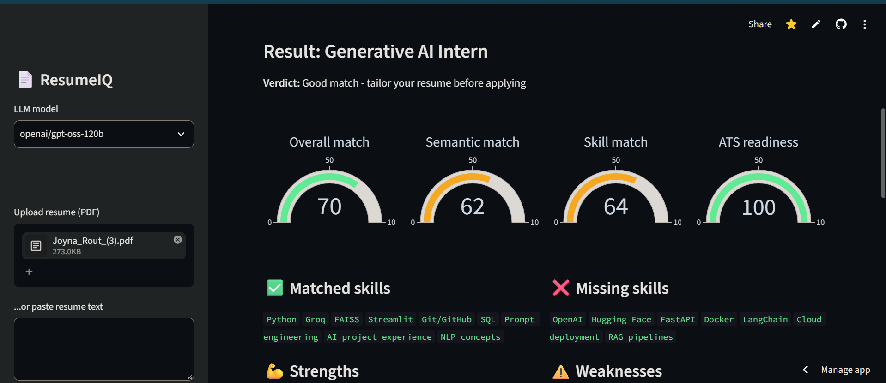
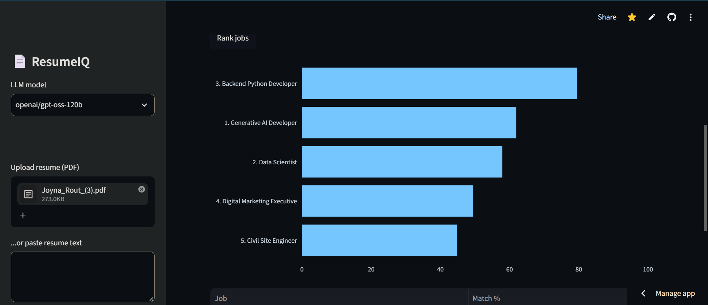
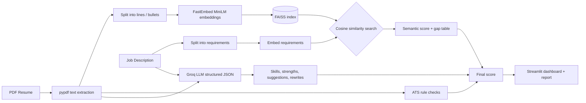

# 📄 ResumeIQ – AI Resume Analyzer & Job Matcher

[](https://resume-iq-joyna.streamlit.app)


Upload a PDF resume, paste a job description, and get an instant **match score**, **skill-gap analysis**, **ATS readiness check** and **tailored rewrite suggestions**, powered by semantic embeddings and a Groq-hosted LLM.

### 🔗 Live demo: **[resume-iq-joyna.streamlit.app](https://resume-iq-joyna.streamlit.app)**

<!-- Add your screenshot after saving it as screenshots/deep_match.png -->


---

## ✨ Features

| Feature | What it does |
|---|---|
| 🎯 **Deep Match** | Compares your resume with one job description and returns an overall score with semantic, skill and ATS sub-scores |
| ✅ **Skill gap analysis** | Lists matched and missing skills for the target role |
| 🛠️ **AI suggestions** | Strengths, weaknesses, actionable improvements, a tailored summary and bullet rewrites |
| 🏆 **Rank Jobs** | Paste several job descriptions and see which roles fit your resume best (instant, no API calls) |
| 📋 **ATS checklist** | Rule-based checks: contact info, key sections, length, quantified achievements |
| ⬇️ **Downloadable report** | Export the full analysis as a Markdown file |
| 🔒 **Privacy-friendly** | Resumes are processed in memory and never stored |

## 🖼️ Screenshots

| Deep Match | Rank Jobs |
|---|---|
|  |  |

## 🧠 How it works



### Scoring

```
Overall = 40% Semantic match + 40% Skill match + 20% ATS readiness
```

- **Semantic match:** for every requirement line in the job description, FAISS finds the most similar line in the resume (cosine similarity). The average is rescaled to 0–100.
- **Skill match:** share of the job's required skills that the LLM finds evidence for in the resume.
- **ATS readiness:** percentage of formatting and content checks the resume passes.

## 🧰 Tech stack

| Layer | Technology |
|---|---|
| Language | Python |
| Interface | Streamlit, Plotly |
| LLM | Groq API (`openai/gpt-oss-120b` by default, selectable in the sidebar) |
| Embeddings | FastEmbed (ONNX) with `all-MiniLM-L6-v2` |
| Vector search | FAISS (`faiss-cpu`) |
| PDF parsing | pypdf |
| Deployment | Streamlit Community Cloud + GitHub |

## 📁 Project structure

```
ResumeIQ/
├── app.py              # Streamlit UI (tabs, charts, sidebar)
├── core.py             # Parsing, embeddings, FAISS matching, ATS checks, LLM calls, report
├── requirements.txt    # Dependencies
├── .env.example        # Template for your API key
├── .gitignore
└── screenshots/        # Images used in this README
```

## 🚀 Run locally

**Prerequisites:** Python 3.11 or 3.12 and a free Groq API key from [console.groq.com](https://console.groq.com).

```bash
# 1. Clone
git clone https://github.com/joyna27/resumeiq.git
cd resumeiq

# 2. Create a virtual environment
python -m venv venv
venv\Scripts\activate            # Windows
# source venv/bin/activate       # Mac / Linux

# 3. Install dependencies
pip install -r requirements.txt

# 4. Add your API key
copy .env.example .env           # Mac / Linux: cp .env.example .env
# open .env and set GROQ_API_KEY=your_key_here

# 5. Run
streamlit run app.py
```

The app opens at `http://localhost:8501`. The first run downloads the embedding model (about 90 MB).

## ☁️ Deploy on Streamlit Community Cloud

1. Push this repo to GitHub.
2. Go to [share.streamlit.io](https://share.streamlit.io) and click **Create app**.
3. Select the repo, branch `main` and main file `app.py`.
4. Under **Advanced settings**, choose Python 3.12 and add this secret:
   ```toml
   GROQ_API_KEY = "your_key_here"
   ```
5. Click **Deploy**.

## 🧪 Try it out

Paste any job description (30+ words) after uploading your resume. For Rank Jobs, separate descriptions with a line containing only `---`.

## ⚠️ Limitations

- Scanned (image-only) PDFs can't be read. Paste the resume text into the sidebar instead.
- Scores are estimates to guide improvements, not the output of a real employer ATS.
- LLM output can occasionally misjudge a skill, so review suggestions before using them.
- Free-tier hosting sleeps when idle, so the first load may take about 30 seconds.

## 🔮 Future improvements

- DOCX resume upload
- Cover-letter generator for the matched job
- Saved analysis history and progress tracking
- Fetching job descriptions directly from a job-posting URL

## 👤 Author

**Joyna** – [GitHub @joyna27](https://github.com/joyna27)

---
⭐ If you found this useful, consider starring the repo.
